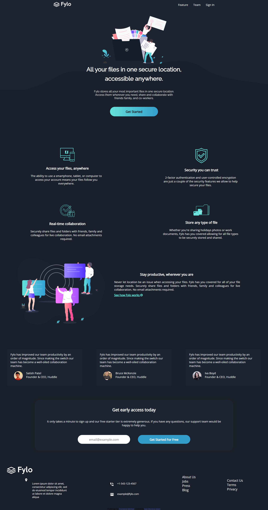

# Frontend Mentor - Fylo dark theme landing page solution

## Table of contents

- [Overview](#overview)
  - [The challenge](#the-challenge)
  - [Screenshot](#screenshot)
  - [Links](#links)
  - [Built with](#built-with)
  - [Useful resources](#useful-resources)
  - [Author](#author)

## Overview

### The challenge

Users should be able to:

- View the optimal layout for the site depending on their device's screen size
- See hover states for all interactive elements on the page

### Screenshot

### Links

- Solution URL: [https://github.com/johnny064/fylo-dark-theme-landing-page-master](https://your-solution-url.com)
- Live Site URL: [https://fylo-dark-theme-landing-page-master-lac.vercel.app/](https://your-live-site-url.com)

### Built with

- Semantic HTML5 markup
- CSS custom properties
- Flexbox
- Mobile-first workflow

## Author

- Website - [Kazi Monirul Islam](https://www.linkedin.com/in/kazi-monirul-islam9251/)
- Frontend Mentor - [@johnny064](https://www.frontendmentor.io/profile/johnny064)

